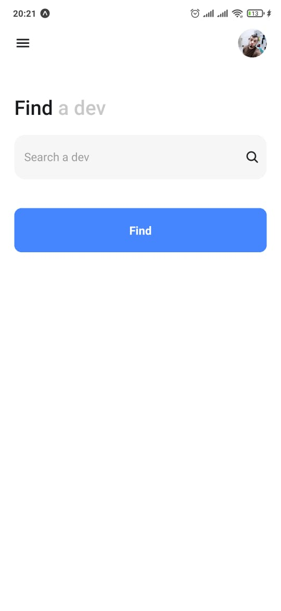
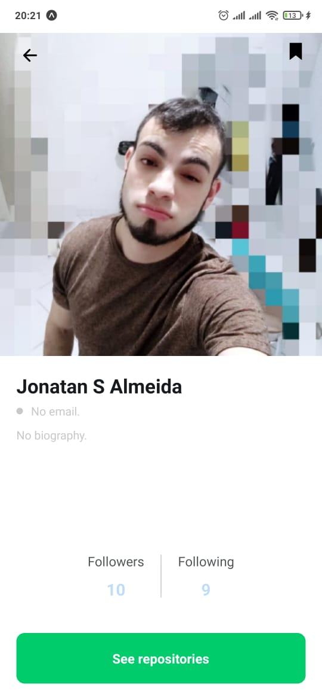
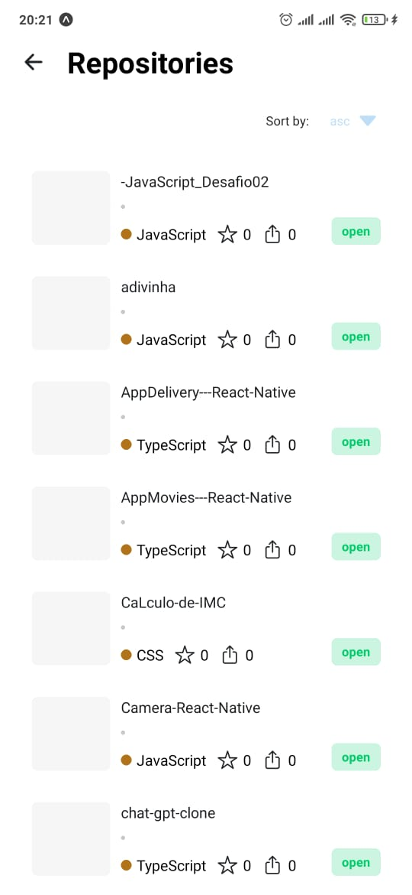
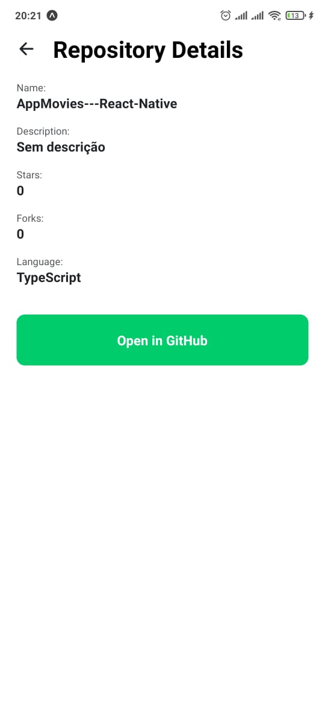

# **Dev Tracker**

Aplicativo para explorar informações de usuários do GitHub. Permite buscar usuários, visualizar detalhes, listar e ordenar repositórios, além de exibir informações detalhadas sobre cada repositório.

---

## **Funcionalidades**

1. **Buscar por um usuário:**  
   Busque informações sobre qualquer usuário do GitHub.  
   Endpoint utilizado: `https://api.github.com/users/{username}`

2. **Ver detalhes do usuário:**

   - Número de seguidores
   - Número de seguidos
   - Avatar do usuário
   - E-mail
   - Bio

3. **Listar repositórios do usuário:**  
   Exibe os repositórios públicos, ordenados por padrão de forma ascendente por ordem alfabeticamente.  
   Endpoint utilizado: `https://api.github.com/users/{username}/repos`

4. **Ordenar repositórios:**  
   Altere a ordem da listagem com base em critérios definidos (alfabética, estrelas e forks).

5. **Ver detalhes de um repositório:**  
   Exibe informações detalhadas sobre um repositório:
   - Nome
   - Descrição
   - Número de estrelas
   - Linguagem utilizada
   - Link externo para o repositório no GitHub  
     Endpoint utilizado: `https://api.github.com/repos/{username}/{repo}`

---

## **Tecnologias utilizadas**

- **React Native**
- **TypeScript** para tipagem
- **Expo** para desenvolvimento nativo
- **React Navigation** para navegação
- **Redux** para gerenciamento de estados
- **Axios** para requisições HTTP
- **Styled Components** para estilização
- **Ionicons** para ícones da interface

---

## **Instalação e execução**

### **Pré-requisitos**

- **Node.js** (v20 ou superior)
- **Yarn** ou **npm**
- **Expo Go** no dispositivo físico ou um emulador Android/iOS configurado

### **Passos**

1. Clone este repositório:
   ```bash
   git clone https://github.com/seu_usuario/seu_repositorio.git
   ```
2. Instale as dependências:
   `npm install` ou `yarn install`

3. Inicie o aplicativo:
   `npm run start` ou `yarn start`

### **Instalação do apk**

- Link para baixar o apk: [https://github.com/brunocarvalho-dev/dev_tracker/releases](https://github.com/brunocarvalho-dev/dev_tracker/releases)

## **Demonstração**

Abaixo estão algumas imagens demonstrando as funcionalidades do aplicativo:

<div style="display: flex; justify-content: center; flex-wrap: wrap; gap: 20px;">
  <div style="flex: 0 1 48%; margin-bottom: 20px;">
    <h3>Demo 1</h3>
    
  </div>

  <div style="flex: 0 1 48%; margin-bottom: 20px;">
    <h3>Demo 2</h3>
    
  </div>

  <div style="flex: 0 1 48%; margin-bottom: 20px;">
    <h3>Demo 3</h3>
    
  </div>

  <div style="flex: 0 1 48%; margin-bottom: 20px;">
    <h3>Demo 4</h3>
    
  </div>
</div>
